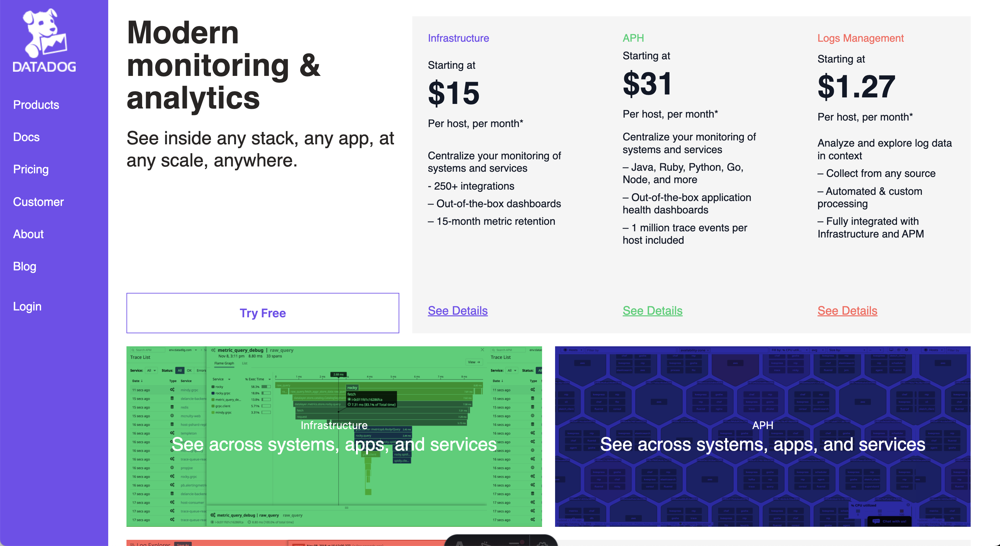
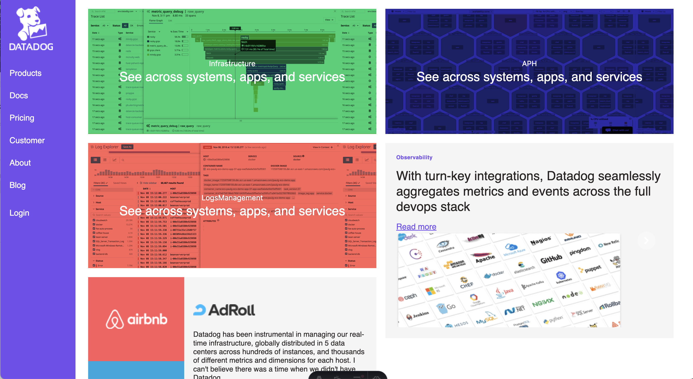
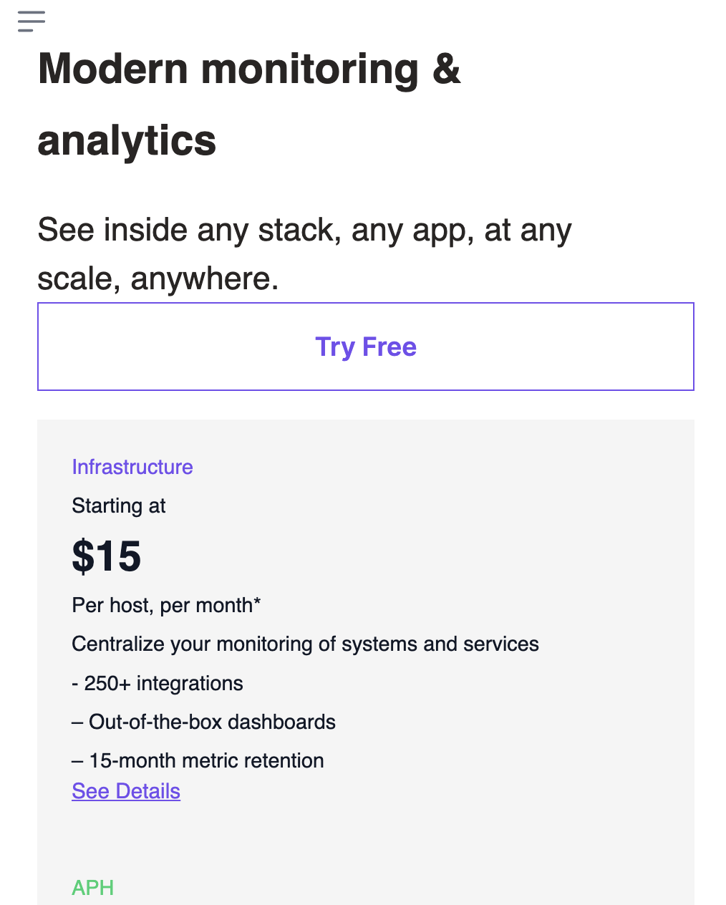

<h1 align="center"> Astro Starter Kit</h1>

<h3>
    This project is being used specifically for the Datadog coding challenge.
</h3>
<p>Here are a few screenshots of how the page should look when rendered</p>

<ul>
<li></li>
<li></li>
<li></li>
</ul>


<br />


<p align="center">
<a href="https://stackblitz.com/github/zankhq/astro-starter">
	
</a>
&nbsp;&nbsp;
<a href="https://codesandbox.io/p/sandbox/github/zankhq/astro-starter">
	
</a>
&nbsp;&nbsp;
<a href="https://codespaces.new/zankhq/astro-starter?devcontainer_path=.devcontainer/blog/devcontainer.json">
	
</a>
</p>

<br />


### Features:

-   ✅ Tailwind CSS
-   ✅ Alpine js
-   ✅ Typescript
-   ✅ Localization (with astro-i18n-aut)
-   ✅ Dark/light mode
-   ✅ Blog
-   ✅ Sitemap (localized)
-   ✅ RSS (localized)
-   ✅ PWA
-   ✅ SCSS

### 🧞 Commands

All commands are run from the root of the project, from a terminal:

| Command                | Action                                           |
| :--------------------- | :----------------------------------------------- |
| `pnpm install`         | Installs dependencies                            |
| `pnpm dev`             | Starts local dev server at `localhost:4321`      |
| `pnpm build`           | Build your production site to `./dist/`          |
| `pnpm preview`         | Preview your build locally, before deploying     |
| `pnpm astro ...`       | Run CLI commands like `astro add`, `astro check` |
| `pnpm astro -- --help` | Get help using the Astro CLI                     |

If you want to switch to npm make sure to remove pnpm-lock.yaml and node_modules folder and then run `npm install`

### 🚀 Project Structure

Inside of your Astro project, you'll see the following folders and files:

```
├── public/
├── src/
│   ├── components/
│   ├── content/
│   ├── layouts/
│   ├── locales/
│   ├── middleware/
│   ├── pages/
│   ├── styles/
│   ├── utils/
│   └── consts.ts/
├── astro.config.mjs
├── README.md
├── package.json
├── .prettierrc
├── tailwind.config.cjs
└── tsconfig.json
```

Astro looks for `.astro` or `.md` files in the `src/pages/` directory. Each page is exposed as a route based on its file name.

There's nothing special about `src/components/`, but that's where we like to put any Astro/React/Vue/Svelte/Preact components.

The `src/content/` directory contains "collections" of related Markdown and MDX documents. Use `getCollection()` to retrieve posts from `src/content/blog/`, and type-check your frontmatter using an optional schema. See [Astro's Content Collections docs](https://docs.astro.build/en/guides/content-collections/) to learn more.

Any static assets, like images, can be placed in the `public/` directory.

### 👀 Want to learn more?

Check out [Astro documentation](https://docs.astro.build) or jump into Astro [Discord server](https://astro.build/chat).
